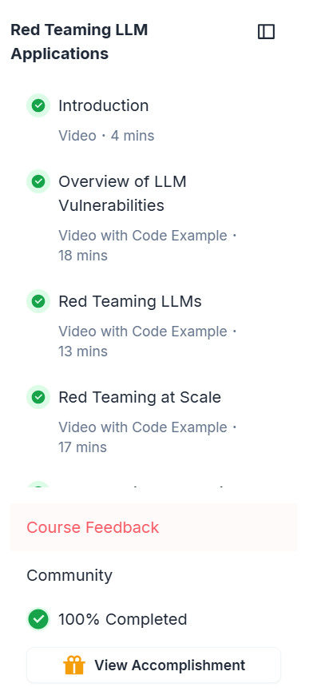
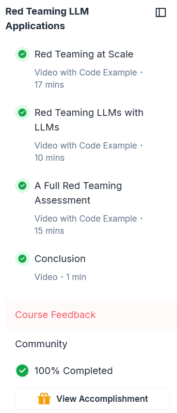

# Laboratorio 7 - Red teaming LLM applications

Laboratorio dedicado a completar todos los módulos del curso en línea [Red Teaming LLM Applications](https://www.deeplearning.ai/short-courses/red-teaming-llm-applications/)

Un curso bastante interesante, me gustó ya que incluía un paso a paso explicado por el vídeo y además que los vídeos iban al grano y tenían corta duración. 

Interesante ver cómo se pueden corromper fácilemnte los LLM, solo se debe de saber formas de pedirle las cosas para ya sea engañarlo o confundirlo con el fin de obtener lo que se busca.

## Screens de curso completado

